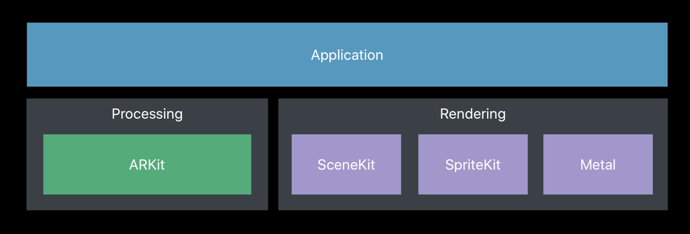
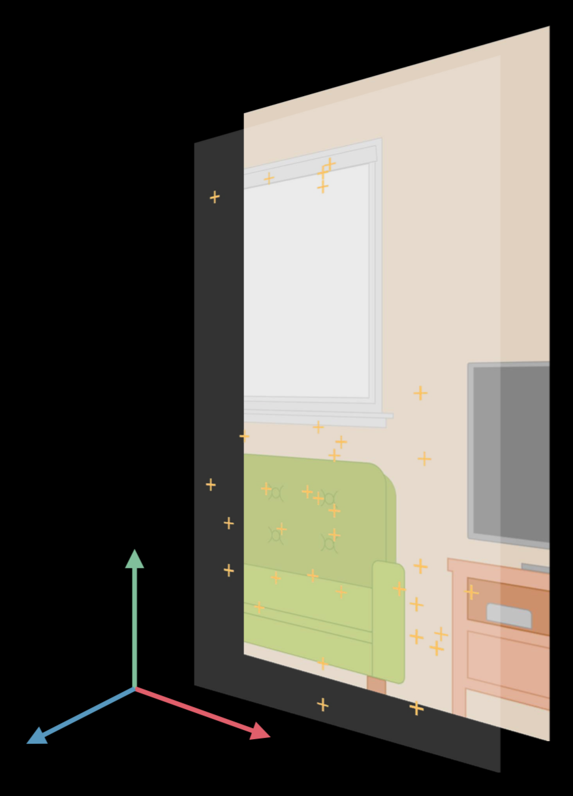
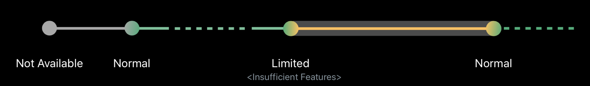

> 지속해서 업데이트할 예정입니다.

ARKit를 공부하며 이해한 것을 바탕으로 기록해보았습니다. 완벽히 이해를 하지 못한 부분은 이에 대한 언급을 하였습니다. 

다음은 공부를 하면서 참고한 영상 및 레퍼런스입니다. 

*Apple Official References about ARKit*

- [Introducing ARKit: Augmented Reality for iOS - WWDC 2017](https://developer.apple.com/videos/play/wwdc2017/602)
- [Understanding ARKit Tracking and Detection - WWDC 2018](https://developer.apple.com/videos/play/wwdc2018/610/)

*Other References about ARKit*

- 추후 업데이트 예정

---

### [Introducing ARKit: Augmented Reality for iOS - WWDC 2017](https://developer.apple.com/videos/play/wwdc2017/602)

### Getting Started

ARKit는 AR에 필요한 프로세스 작업을 맡고 오브젝트를 랜더링은 `SceneKit`, `SpriteKit` 그리고 `Metal`이 맡는다.



그리고 AR 프로세스 작업에는 내부적으로 `AVFoundation`과 `Core Motion`을 사용한다.

- `AVFoundation` - 카메라 영상으로부터 들어오는 데이터 제공
- `Core Motion` - 디바이스의 모션 데이터를 제공

ARKit에서 AR 작업을 위한 주요 프로세스는 `ARSession`이 담당한다.

#### [`ARSession`](https://developer.apple.com/documentation/arkit/arsession)

공유 객체로 증강 현실 경혐 구축에 필요한 디바이스 카메라와 모션 처리를 관리.

`ARSession` 객체는 증강 현실 경험을 만들기 위해 ARKit가 수행하는 주요 프로세스를 조정한다. 이 프로세스에는 디바이스 모션 감지 하드웨어로부터 데이터 읽기, 디바이스에 내장된 카메라 조정 그리고 캡쳐된 카메라 이미지들로부터의 이미지 분석 수행이 포함된다. 세션은 이러한 작업들의 결과를 통합하여 장치가 실제 존재하는 공간과 AR 컨텐츠를 모델링하는 가상 공간 사이의 연결을 구축한다. 

그리고 이 세션은 원하는 필요로하는 기능에 따른 `ARConfiguration` 서브 클래스를 필요로 한다.

#### [`ARConfiguration`](https://developer.apple.com/documentation/arkit/arconfiguration)

AR 세션 구성을 위한 추상 클래스로 이 클래스의 인스턴스를 직접 만들거나 작업해선 안된다. 

AR 세션을 실행시키기 위해선 당신이 제작하는 앱이나 게임에서 필요한 AR 경험 종류에 따라 알맞는 [`ARConfiguration`](https://developer.apple.com/documentation/arkit/arconfiguration)의 서브클래스들의 인스턴스를 생성해서 사용해야 한다. 그리고 구성 객체의 프로퍼티를 지정하고 이를 세션의 [`run(_:options:)`](https://developer.apple.com/documentation/arkit/arsession/2875735-run) 메소드에 전달한다. ARKit는 다음과 같은 구성 클래스들을 포함하고 있다.

- [`ARWorldTrackingConfiguration`](https://developer.apple.com/documentation/arkit/arworldtrackingconfiguration) 
  - 후면 카메라를 활용해 디바이스의 위치와 방향을 정교하게 추격하고 지면 감지, 히트 테스팅, 환경에 기반한 조명, 이미지와 사물 인식이 가능한 상위 수준의 AR 경험을 제공
- [`AROrientationTrackingConfiguration`](https://developer.apple.com/documentation/arkit/arorientationtrackingconfiguration)
  - 후면 카메라를 활용해 디바이스의 방향만을 추적하는 기본적인 AR 경험을 제공
- [`ARImageTrackingConfiguration`](https://developer.apple.com/documentation/arkit/arimagetrackingconfiguration)
  - 후면 카메를 활용해 사용자 환경에 상관없이 가시적인 이미지들을 추적하는 기본적인 AR 경험을 제공
- [`ARFaceTrackingConfiguration`](https://developer.apple.com/documentation/arkit/arfacetrackingconfiguration)
  - 전면 카메라를 활용해 사용자 얼굴의 움직임과 감정을 추적하는 AR 경험을 제공
- [`ARObjectScanningConfiguration`](https://developer.apple.com/documentation/arkit/arobjectscanningconfiguration)
  - 후면 카메라를 활용해 고성능 공간 데이터를 수집하고 다른 AR 경험에서의 감지를 위한 참조 객체를 생성


`ARSession`의 `run` 메소드에 `ARConfiguration` 서브클래스 오브젝트를 넣어 실행시키면 위에서 언급한 것 처럼 `ARSession`은 내부적으로 `AVCaptureSession`과 `CMMotionManager`를 통해 필요한 데이터를 받아 처리하고 이의 결과물을 초당 60프레임으로  `ARFrame` 객체를 반환한다. 이를 도식화하면 다음과 같다.


다음은 각 요소들의 기능과 대표적인 속성들이다.

- **`ARConfiguration`**

  - 기능을 활성화거나 비활성화할 수 있다.
  - 현재 디바이스가 해당 `ARConfiguration`을 지원하는지를 알 수 있다. (`isSupported`)

- **`ARSession`**

  - AR 프로세싱을 관리한다. 
    - `run`
    - `pause`
  - 트래킹 초기화
    - 카메라 포지션을 초기화 (0, 0, 0)
  - 세션 갱신
    - [`ARSessionDelegate`](https://developer.apple.com/documentation/arkit/arsessiondelegate)
      - `session(_,didAdd:)`
      - `session(_,didUpdate:)`
      - `session(_,didRemove:)`
  - 현재 프레임
    - [`currentFrame`](https://developer.apple.com/documentation/arkit/arsession/2865621-currentframe)

- **`ARFrame`**

  - 캡쳐된 이미지 - 카메라 뷰로부터 캡쳐된 이미지로 배경에 사용된다.
  - 트래킹 데이터 - Orientation, Tracking State
  - 장면 이해 - Feature points, Light Estimation

  > 아래의 그림에서 노란색 십자가들이 Feature point들로 ARKit가 현재 프레임 내에서 특징적인 부분이라고 생각한 지점이다.

  

- **`ARAnchor`**
  - 카메라의 움직임에 따른 오브젝트의 위치와 방향을 트래킹하는데 사용할 수 있으며 구성하는 `ARConfiguration`의 종류에 따라 세션은 자동으로 `ARAnchor`를 추가하기도 한다. 현재 장면에서 오브젝트를 추가하여 해당 위치에 고정시키고 싶다면 `ARAnchor`를 추가하면 된다. 
    - World-Tracking Session - [`ARPlaneAnchor`](https://developer.apple.com/documentation/arkit/arplaneanchor), [`ARObjectAnchor`](https://developer.apple.com/documentation/arkit/arobjectanchor), [`ARImageAnchor`](https://developer.apple.com/documentation/arkit/arimageanchor)
    - Face-Tracking Session - [`ARFaceAnchor`](https://developer.apple.com/documentation/arkit/arfaceanchor)
  - 모든 3D 오브젝트는 기준점을 갖고 있는데 이 기준점과 `ARAnchor`가 만나야 오브젝트는 띄울 수 있다.

> 사실 아직 `ARAnchor`에 대한 명확한 개념이 잡히지 않았다. 내가 궁금한 것은 다음과 같다.
>
> 1. Feature point들과의 차이점. `ARAnchor`도 Feature point들 중 하나인가?
> 2. ARKit이 `ARAnchor`를 정하는 방식
>
> 이에 대한 의문점이 해결되면 추후에 작성해봐야겠다.

### Tracking

#### World Tracking

World-Tracking은 다음의 목록에 해당하는 것들을 트래킹한다. 

- 위치와 방향
- 물리적 거리 ( 미터 단위)
- 시작 지점으로부터의 
- 3D-feature points

> 3D-feature point 트래킹은 [WWDC 영상](https://developer.apple.com/videos/play/wwdc2017/602)의 14:50을 확인.

이러한 기능들로 World-Tracking은 다음과 같이 물체는 항상 그 위치에 존재하며 크기 역시 디바이스와의 거리에 따라 달라지며 어느 위치에서 보아도 해당 시점에 해당하는 모습을 보여준다.


다음과 같이 간단한 코드를 `ARWorldTrackingConfiguration`의 세션을 실행시킬 수 있다.

```swift
let session = ARSession()
session.delegate = self
let configuration = ARWorldTrackingConfiguration()
session.run(configuration)
```

위에서 언급한 것처럼 `ARSession`은 내부적으로 `AVCaptureSession`과 `CMMotionManager`의 도움을 받는다. 이 둘이 제공하는 데이터를 사용하여 하나의 프레임을 생성하는 것이다. 


`AVCaptureSession`의 빈도가 더 적은 것을 볼 수 있다. `AVCaptureSession`을 통한 카메라 뷰의 데이터를 처리하는데는 비교적 많은 계산 시간과 CPU 자원을 필요로 한다. 그리고 `CMMotionManager`의 모션 데이터는 너무 긴 시간동안의 데이터 수집은 오히려 잠재적인 오류들을 포함할 수 있다. 그렇기 때문에 이 둘을 모두 사용하여 하나의 프레임을 적절히 만드는 것이다. 

#### ARCamera

`ARSession`에서 캡쳐된 비디오 프레임에서의 카메라 위치 및 이미지 특성에 대한 정보를 담고 있다. 또한 트래킹 상태([`ARCamera.TrackingState`](https://developer.apple.com/documentation/arkit/arcamera/trackingstate))에 대한 정보 역시 담고 있고 트래킹 상태에 대해서는 밑에서 더 자세히 알아보도록 하자. 

> 카메라 뷰가 활성화되었을 때 후면 카메라가 향하고 있는 방향이 `-z` 방향이다. 카메라의 시작점이 `(0,0,0)`이 된다.


#### Tracking Quality

트래킹 퀄리티는 다음의 세 가지 요소에 의해 결정된다. 

- 센서 데이터의 흐름성
  - 카메라 뷰가 비활성화되어 시각 데이터를 제공받지 못하는 등의 상황이 된다면 트래킹 퀄리티는 저하된다.
- 질감이 존재하는 환경
  - Feature point, 즉 특징적인 점을 찾을 수 있는 환경이 되어야 한다. 어두운 환경에 있거나 흰 벽을 바라보고 있는 환경에선 트래킹 퀄리티는 저하된다.
- 정적인(*Static*) 장면
  - 너무 빠른 움직임이나 모션 데이터와 이미지 데이터가 불일치하는 경우 트래킹 퀄리티는 저하된다
    - 오르내리는 엘리베이터나 달리는 버스 안 

트래킹 퀄리티는 열거형인 [`ARCamera.TrackingState`](https://developer.apple.com/documentation/arkit/arcamera/trackingstate) 열거형으로 표현되고 세 가지의 케이스가 존재한다.

- `notAvailable` - 트래킹이 시작되지 않은 상태
- `limited(ARCamera.TrackingState.Reason)` - 트래킹 퀄리티가 낮은 상황으로 제공하고자하는 서비스를 제대로 제공할 수 없는 상황으로 이는 그 이유([`ARCamera.TrackingState.Reason`](https://developer.apple.com/documentation/arkit/arcamera/trackingstate/reason))와 함께 제공된다. 
  - 이를 활용해 원할한 트래킹이 가능하도록 사용자의 행동을 유도할 수 있다. (기본 앱인 Measure에서도 면에 대한 충분한 인식이 이루어지지 않으면 측정이 불가능하기 때문에 사용자가 디바이스를 움직이도록 유도한다.)
- `normal` - 트래킹을 하고 있는 보통 상태 




#### Session Interruptions

세션의 흐름은 몇 가지 이유로 끊길 수 있다.

- Camera input unavailable
  - 앱의 백그라운드 진입
  - 아이패드의 멀티태스킹 - 두 앱을 동시에 띄우는 상황
- Trakcing is Stopped

우리는 이러한 세션의 흐름이 끊겼다는 사실을 [`ARSessionObserver`](https://developer.apple.com/documentation/arkit/arsessionobserver) 프로토콜의 메소드를 통해 처리해줄 수 있다.

```swift
func sessionWasInterrupted(_ session: ARSession) {
    showOverlay()
}

func sessionInterruptionEnded(_ session: ARSession) {
    hideOverlay()
}
```

> Interruption은 세션을 수동으로 정지시키는 것과 동일하다. 이 콜백에 대한 응답으로 `pause ()`를 호출하면 인터럽트가 끝날 때 앱에 알림이 전송되지 않습니다

